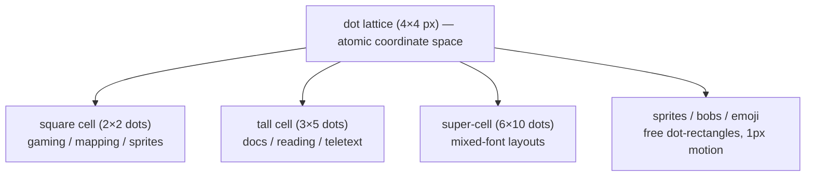

# Grid Cell Algebra — Dot Lattice & Cell Registers

**Date**: 2026-08-17
**Status**: current
**Purpose**: Defines the single coordinate space that unifies the two grid fonts
(terminal 8×8, teletext 12×20), the 2×3 graphic blocks, sprites/bobs, and
BASIC runtime addressing — so grid cells come back without forcing the two
fonts into one aspect ratio.

## The invariant: the dot

- One **dot** = 4×4 device pixels.
- 4 = gcd(8, 12) = gcd(8, 20) — the largest unit that both glyph dimensions
  tile with whole numbers.

```
dot = 4×4 px
```

## Cell registers

A cell is a dot-rectangle. Two named registers cover the two faces:

| Register   | Glyph | Dots | Aspect | Default for                   |
| ---------- | ----- | ---- | ------ | ----------------------------- |
| **square** | 8×8   | 2×2  | 1:1    | gaming, mapping, sprites/bobs |
| **tall**   | 12×20 | 3×5  | 3:5    | docs, reading, teletext       |

The registers are **interchangeable** because the dot is the common unit — a
single layout may mix square and tall cells on the same lattice.

## Pitches (mixed-font alignment)

- **Column pitch** = lcm(8, 12) = 24 px = 6 dots → 3 square cells = 2 tall
  cells per column block.
- **Row pitch** = lcm(8, 20) = 40 px = 10 dots → 5 square rows = 2 tall rows
  per row block.

## Super-cell

- **24×40 px = 6×10 dots.**
- Holds 3×5 square cells **or** 2×2 tall cells — the tile both fonts share
  exactly. It matches the two atlas cells already in use: terminal 24×24
  (6×6 dots) and Bedstead 24×40 (6×10 dots).

## Layers



## 2×3 graphic blocks

- Each block = ½ cell width × ⅓ cell height — a subdivision of a **cell**, not
  of the lattice.
- Bedstead: real SAA5050 sextants (U+1FB00–1FB3B) from the glyph atlas.
- Terminal: algorithmic 2×3 mosaic (`mosaic: true`).
- Because blocks are per-cell, they don't need cross-font dot alignment; they
  render inside whichever register is active.

## BASIC runtime addressing

| Layer    | Resolution                  | API shape       |
| -------- | --------------------------- | --------------- |
| text     | cell (square or tall)       | `PRINT @x,y`    |
| graphics | dot (4px) or 1px            | `PLOT` / `DRAW` |
| sprites  | 1px motion over the lattice | `SPRITE`        |

## Coordinates

- A position is `(col, row)` in dots.
- A cell at `(cx, cy)` of register `w×h` dots occupies the dot rect
  `[(cx·w, cy·h), ((cx+1)·w, (cy+1)·h))`.
- Text = cell resolution; graphics/sprites = dot (or sub-dot 1px) resolution;
  both share one origin.

## Mapping to the code

- Both atlases are already baked 24 wide — the column pitch (24 px) is already
  unified in `gridui-canvas`.
- Cell sizing modes (`native` / `square` / `fit-exact`) are views on top of this
  lattice.
- **Implemented**: `packages/gridcore/src/coordinates/dot.ts` — `DOT_PX`, the
  `square`/`tall` cell registers, pitch + super-cell constants, and
  cell ↔ dot ↔ px conversions (exported from `@udos/gridcore`, with tests).
- **Wired into the renderer**: `gridui-canvas` exposes `cellRegister`,
  `dotSize`, `dotRectForCell`, `cellAtDot` and `dotToCss`, so cell and
  sprite/bob coordinates share one lattice origin.

