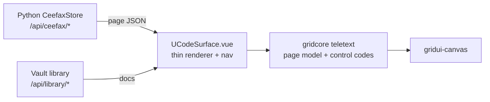

# Teletext / Ceefax Architecture

Status: **reconciliation in progress** — three independent implementations exist
and need to converge on one source of truth.

## The three implementations

### 1. Canonical TypeScript — `uCode/packages/gridcore/src/teletext/`

The package-level, framework-agnostic implementation. This is the intended
**source of truth** for the page model and the MODE 7 control codes.

| File                  | Role                                                                                                        |
| --------------------- | ----------------------------------------------------------------------------------------------------------- |
| `control.ts`          | BBC MODE 7 control codes (`0x00`–`0x1F`) and the line interpreter.                                          |
| `teletext-surface.ts` | `TeletextSurface`, `TeletextPage`, `FastTextLink`, `PageLoader`. 40×25 default.                             |
| `page-provider.ts`    | `TeletextPageProvider` with static pages 100/101/300–310/400–410/500–510/888/199 + vault/course/feed types. |
| `mosaic.ts`           | Mosaic (sextant) block ↔ pattern conversion.                                                                |
| `block2x3.ts`         | 2×3 block-graphics model.                                                                                   |

It is already reachable from the frontend via the Vite alias
`@udos/gridcore → uCode/packages/gridcore/src/index.ts`.

### 2. Python backend runtime — `uCode/ucode_runtime/ceefax.py`

The backend-served, feed-based content source.

- `CeefaxStore` — in-memory 48×36 page buffer + feed items.
- `register_ceefax_routes()` — registers `/api/ceefax/page/{num}`,
  `/api/ceefax/pages`, `/api/ceefax/feed/latest`, `/api/ceefax/feeds`.
- Loaded by `uCore/backend/app/extensions/adapters/ucode_runtime_adapter.py`,
  configurable via `UCORE_CEEFAX_ROUTE_REGISTRAR` / `UCORE_CEEFAX_STORE_FACTORY`.

### 3. Frontend inline — `uCore/frontend-vue/src/surfaces/ucode/UCodeSurface.vue`

The **active user-facing reader** (Sprint E deliverable). It fetches vault
content over `/api/library/*`, builds pages client-side, and renders them
through the shared `<gridui-canvas>` with double-height titles, separated
graphics, mosaic rules, subpage rotation, and fastext keyboard navigation.

It duplicates, inline, a large part of what already exists in implementations
1 and 2: the `TeletextPage` model, control-code writing helpers
(`writeBoxedDoubleHeightTitle`, `writeSeparatedBar`, `writeMosaicRule`), and
the page-building logic.

## The problem

Three copies of the same concepts drift independently:

- **Page model** — `TeletextPage` exists in TS (1) and again as a local
  interface in the Vue component (3); Python (2) has a third shape
  (`{number, title, buffer[48][36], source}`).
- **Control codes** — authoritative constants live in `control.ts` (1), but the
  Vue component (3) re-hardcodes them.
- **Page building** — `TeletextPageProvider` (1) and the Vue `docScreens`
  builders (3) both construct index/news/course pages.

## Target architecture



1. **One page model + control codes** live in `packages/gridcore/src/teletext/`
   (implementation 1). The Vue component imports them via `@udos/gridcore` and
   stops redefining them.
2. **Python** remains the _content/feed_ authority behind `/api/ceefax/*`, and
   conforms to the same page JSON schema (see below).
3. **The Vue component** becomes a thin renderer + navigation shell: it takes a
   page (from either the vault builder or `/api/ceefax/*`) and paints it.

## Shared page JSON schema

The convergence point for all three. `rows` × `cols` cells; each cell carries
glyph + colour state so the renderer stays byte-agnostic.

```jsonc
{
  "page": 250,
  "title": "SNACKS_SKILLS_STATUS_AUDIT",
  "cols": 40,
  "rows": 25,
  "subpages": 18, // optional, rotating subpage count
  "fastext": ["Index", "News", "Docs", "Help"], // 4 fastext labels
  "lines": [
    // 25 rows, each 40 cells
    [{ "char": " ", "fg": 7, "bg": 0, "doubleHeight": false, "mosaic": false }],
  ],
}
```

## Unification plan

| Phase | Scope                                                                                                                               | Deliverable                                                                  |
| ----- | ----------------------------------------------------------------------------------------------------------------------------------- | ---------------------------------------------------------------------------- |
| E1    | Extract the Vue teletext page model + helpers into `frontend-vue/src/grid-core/teletext/` as a module, keeping behaviour identical. | `TeletextPage`, `TeletextBuilder` exported; `UCodeSurface.vue` imports them. |
| E2    | Re-point those types/helpers at `packages/gridcore/src/teletext/` via `@udos/gridcore`; delete the local duplicates.                | Single control-code + page-model source.                                     |
| E3    | Adopt the shared page JSON schema in Python `/api/ceefax/*` (48×36 → 40×25 or reader-tolerant sizing).                              | Frontend can consume Python pages unchanged.                                 |
| E4    | Add a `TeletextPageProvider` for vault docs, feeding the Vue shell from implementation 1's provider.                                | Vault-driven pages use the canonical builder.                                |

## Verification

- `pnpm test:golden` (Playwright) — glyph + teletext rendering regressions.
- `vitest` — `glyph-atlas`, `render-seed`, `layer-map` suites.
- `npm run build` / `vue-tsc --noEmit` — type safety across the extraction.
